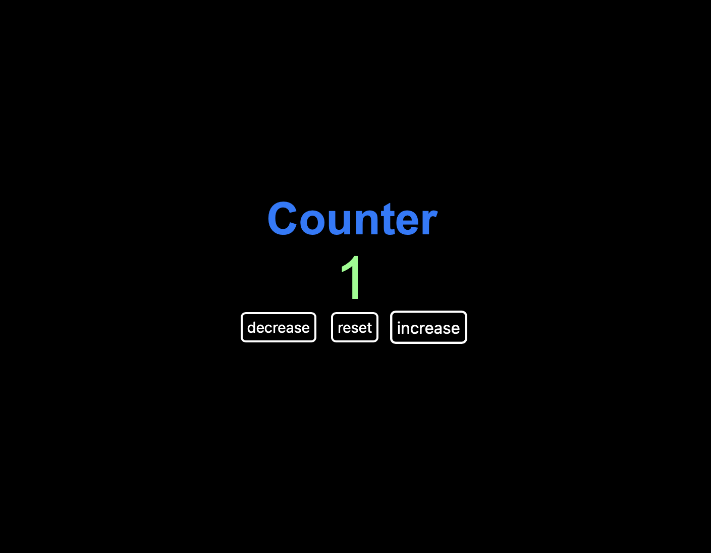

# Simple Counter

> A simple counter with `decrease`, `reset` and `increase` functionalities.

## Table of contents

- [Simple Counter](#simple-counter)
  - [Table of contents](#table-of-contents)
  - [General info](#general-info)
  - [Screenshots](#screenshots)
  - [Technologies](#technologies)
  - [Setup](#setup)
  - [Code Examples](#code-examples)
  - [Status](#status)

## General info

> The objective of the project is to practice separation of concerns in
> JavaScript and use `setInterval` and `clearInterval` APIs.

## Screenshots



## Technologies

- JavaScript
- HTML5
- CSS3
- VS Code

## Setup

Clone the repo and run npm install.

## Code Examples

```js
btnArray.map((nameBtn) => {
  const btn = document.createElement('button');
  btn.classList.add('btn');
  btn.textContent = nameBtn;

  btn.addEventListener('click', () => getControl(nameBtn));

  buttonsContainer.appendChild(btn);
});
```

## Status

Project is: _done_
